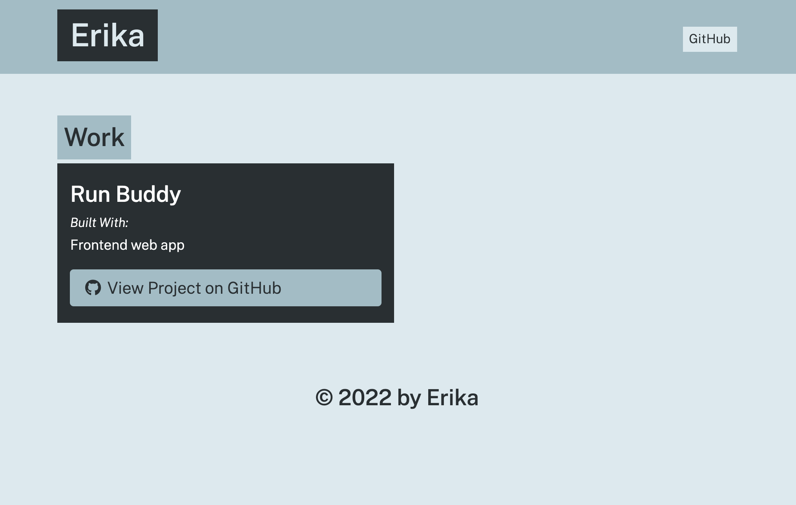

# portfolio-generator

## Description 
Portfolio-Generator is a back-end app that allows a user to crete a portfolio by answering promt questions when running the server. 

## Screenshot 

## Installation 
* `run node app.js`
* `answer propmt questions`
* `open app on browser`
---

🏆 
## Badges

## Contributing / Credits

[mariamv29](https://github.com/mariamv29/README-generator.git)
